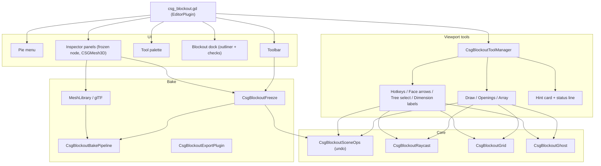

# CSG_Blockout Architecture & Technical Internals

*Read this in other languages: [简体中文](ARCHITECTURE_CN.md) | [Back to Main Docs](README.md)*

This document is for developers who want to know how `CSG_Blockout` works inside, extend it, or debug it.

---

## Table of Contents
- [1. Module Map](#1-module-map)
- [2. Viewport Input and Tools](#2-viewport-input-and-tools)
- [3. Undo: One Action Builder](#3-undo-one-action-builder)
- [4. Reversible Bake (Freeze)](#4-reversible-bake-freeze)
- [5. Raycasting and the Level Check](#5-raycasting-and-the-level-check)
- [6. Play From Here](#6-play-from-here)
- [7. Pipeline Exports](#7-pipeline-exports)
- [8. Spreader: 3D Spatial Hash Grid](#8-spreader-3d-spatial-hash-grid)
- [9. World-Aligned Triplanar Grid Shader](#9-world-aligned-triplanar-grid-shader)
- [10. GDScript 2.0, Export Safety and Engine Versions](#10-gdscript-20-export-safety-and-engine-versions)
- [11. Node Reference](#11-node-reference)
- [12. Settings Reference](#12-settings-reference)

---

## 1. Module Map

`csg_blockout.gd` (the `EditorPlugin`) only wires things together. Features live in `scripts/`:

| Folder | Contents |
| :--- | :--- |
| `scripts/core/` | Shared building blocks: undoable scene edits (`CsgBlockoutSceneOps`), raycasting against CSG (`CsgBlockoutRaycast`), the grid (`CsgBlockoutGrid`), ghost previews (`CsgBlockoutGhost`), primitive geometry helpers (`CsgBlockoutShapeInfo`), node creation (`CsgBlockoutNodeFactory`), selection helpers, rebindable shortcuts (`CsgBlockoutShortcuts`) and the engine-version layer (`CsgBlockoutCompat`). |
| `scripts/tools/` | Viewport tools: the tool manager, draw (box/room), openings (door/window), face push/pull, duplicate along an axis, keyboard transforms, Play From Here. |
| `scripts/bake/` | Freeze/unfreeze, the bake pipeline (collision, UV2, occluder, LODs), the frozen-node Inspector panel, the export plugin, MeshLibrary export and the glTF round trip. |
| `scripts/inspector/` | The `CSGMesh3D` manifold check and its Inspector panel. |
| `scripts/metrics/` | Dimension labels, the player reference node and gizmo, the level check, semantic tags. |
| `scripts/outliner/` | The Blockout dock (outliner + Checks tab) and semantic naming. |
| `scripts/runtime/` | Scripts that run in the game: the Play From Here launcher and test character. They must not reference editor classes. |
| `scripts/patterns/` | `CSGPattern` resources used by `CSGRepeater3D`. |
| `scripts/i18n/` | String tables for the 7 interface languages, merged by `CsgBlockoutI18n`. |
| `scripts/` (root) | The pie menu, the tool palette (left of the viewport), the toolbar, the shortcut cheat sheet, configuration (`CsgBlockoutConfig`), and the custom nodes `CSGRepeater3D`, `CSGSpreader3D`, `CSGStairs3D`, `CSGRuler3D`. The palette and toolbar build their controls in code; there are no `.tscn` files for them. |
| `benchmarks/` | The reproducible benchmark ([BENCHMARKS.md](BENCHMARKS.md)); excluded from Asset Library downloads. |

---

## 2. Viewport Input and Tools

The plugin enables input forwarding permanently (`set_input_event_forwarding_always_enabled`) and draws its overlays over every 3D viewport (`set_force_draw_over_forwarding_enabled`). `_forward_3d_gui_input` routes each event in this order:

1. **Pie menu**: the configured modifier + `A` opens it; nothing else sees the event while it's open (`Esc` closes it). It never opens while the right mouse button is held (fly navigation).
2. **HUD**: clicks on the hint card's key caps and **Esc**, and on the status line's action ("Next ›"), are handled by the tool manager.
3. **Right mouse button**: always passed to Godot's freelook. A right-click without movement leaves the active tool.
4. **Active modal tool** (draw, openings, duplicate along an axis): `Esc` leaves it, otherwise it gets the event first.
5. **Passive tools**, by input priority: dimension labels (`CsgBlockoutMeasureOverlay`, first because labels are drawn over the arrows), keyboard transforms and the grid keys (`CsgBlockoutTransformHotkeys`), face arrows (`CsgBlockoutFaceDrag`), double-click tree selection (`CsgBlockoutTreeSelect`).
6. Everything else passes through to Godot.

Tools derive from `CsgBlockoutTool` (`input`, `draw_overlay`, `cancel`, `chip`) and return `PASS` or `STOP`. Modal tools are one-shot: after one result they call `manager.finish()`, which ends them unless the user locked the tool with a double-click on its button. A click that doesn't start a drag ends the tool and selects what's under the cursor (`manager.select_at()`), so a tool never traps the mouse.

`chip()` describes the tool for the hint card at the top of the viewport: a title, the next step, and key caps for the options it takes. Feedback goes to the status line below it (`CsgBlockoutStatus.report()`): a message, optionally one clickable action, fading after a few seconds. Errors, and warnings that matter later, are also sent to Godot's toaster. Keys are matched against shortcuts registered in Editor Settings under `csg_blockout/`; apart from a Play From Here key you bind yourself, they are only intercepted while blockout is selected or a tool is active.

Previews (the draw ghost, cut previews, array copies, problem edges) are `RenderingServer` instances: they never enter the scene tree, never mark the scene as modified and never create undo entries. Heavy work happens on release: while you drag, only the ghost moves.

---

## 3. Undo: One Action Builder

Every scene change goes through `CsgBlockoutSceneOps.Action`, which collects `add_node`, `remove_node`, `reparent`, `set_property`, `assign_meta`, `rename` and `select` operations and commits them as one `EditorUndoRedoManager` action in the edited scene's history (with backward undo ops, so undo runs in reverse order). It takes care of the details that make undo/redo reliable:

- **Ownership**: nodes added with their subtree get the scene root as owner; nodes removed and re-added by redo get their exact previous owners back.
- **Selection** is restored on undo.
- **Merging**: repeated nudges merge into one undo step.

The pie menu, the palette and every tool share it, so creating, cutting, pushing a face, freezing and unfreezing all undo the same way.

---

## 4. Reversible Bake (Freeze)

Freezing swaps a CSG root for a `MeshInstance3D` with the same name and transform. Everything needed to undo that lives in editor-only metadata (names starting with `_` are saved but hidden from the Inspector):

| Metadata | On | Holds |
| :--- | :--- | :--- |
| `_csg_blockout_source` | frozen node | The CSG subtree as a `PackedScene` (ownership mirrored, non-CSG extras removed). |
| `_csg_blockout_bake` | frozen node | The bake options it was frozen with. |
| `_csg_blockout_generated` | generated children | Marks the `Collision` body and `Occluder` so a rebake can replace them. |
| `_csg_blockout_home` | non-CSG extras | Where a light or marker lived inside the CSG tree, as a path relative to the root. |
| `_csg_blockout_shell` | unfrozen CSG root | The frozen node minus generated content (script, groups, layers, user children), reused by the next freeze. |
| `_csg_blockout_gltf` | frozen node | glTF export record: file, file time, material name map. |
| `_csg_blockout_refined` | frozen node | Set while a refined mesh from the glTF round trip is in use. |

**Freeze**: wait one frame for pending CSG updates; bake through `CsgBlockoutBakePipeline` (a copy of `CSGShape3D.bake_static_mesh()`, then collision, UV2, occluder and LODs as configured); pack the source; move non-CSG extras onto the frozen node; add the frozen node under a temporary name, remove the CSG root, then take over the original name, all in one action. NodePath references from outside into the tree are collected once per action and reported.

**Unfreeze** instantiates the stored source at the frozen node's current transform, stashes the frozen node as the shell, and moves the extras back home.

**Rebake** instantiates the stored source next to the frozen node on render layer 0 (computed, never drawn), waits for it to build, bakes it with the new options and replaces the mesh and generated children in one action. A refined mesh is dropped.

**Export**: `CsgBlockoutExportPlugin._customize_scene` strips all the metadata above and removes editor-only helper nodes (rulers, player references) from exported scenes, unless `bake/strip_source_on_export` is off.

---

## 5. Raycasting and the Level Check

Tools need exact hits on CSG, which has no physics bodies in the editor. `CsgBlockoutRaycast.cast()`:

1. Finds candidate instances along the ray with `RenderingServer.instances_cull_ray` (bounding boxes only).
2. For each candidate CSG root or `MeshInstance3D` (frozen blockout included), builds a `TriangleMesh` from its current mesh, cached per node and rebuilt when the node's mesh changes (a CSG root gets a new mesh on every rebuild), and intersects it in local space. The normal is turned to face the ray.
3. Reports the hit position, normal and node, and for CSG the primitive whose surface is closest to the hit (plus the closest solid primitive, for hits on cut faces). With no hit, it falls back to the ground plane (y = 0).

**Level check** (`CsgBlockoutValidator`) reads the triangles of every CSG root:
- **Slopes**: faces between the walkable angle (`max_slope_angle`) and 80° (steeper counts as a wall).
- **Ceilings**: walkable faces are sampled on a world-aligned 0.5 m grid; from each sample a ray goes up. A ceiling below standing height is orange, below crouch height red. Samples covered by solid geometry (floor under a ramp, say) are skipped: there the first face above the sample faces up, judged from its winding via `face_index`, since `TriangleMesh` doesn't orient its normals. So are samples on ledges narrower than the capsule radius, like window sills: half a capsule radius away along X and along Z, a downward ray has to find floor at about the same height on at least one side of each axis.
- Issues are grouped per ceiling primitive and kind, highlighted in the viewport and listed in the Checks tab.

---

## 6. Play From Here

1. The editor finds the spawn point (raycast at the viewport center or the cursor) and the camera's yaw, and writes `user://csg_blockout/play_here.json` with the scene path, spawn, player metrics and the localized HUD text.
2. It starts the plugin's launcher scene with `EditorInterface.play_custom_scene()` (respecting "Save Before Running").
3. The launcher (`scripts/runtime/`) loads the requested scene as the current scene, turns on `use_collision` for visible CSG roots without it and gives frozen blockout without a collision body a trimesh one (for this run only; the editor reports how many on the status line), adds a sun and a procedural sky if the scene has none, and spawns `CSGBlockoutTestPawn`.
4. The pawn is a `CharacterBody3D` that reads physical keys directly, so the project's input map and autoloads are untouched. Its numbers come from the player metrics: jump velocity `v = √(2·g·h)` from `single_jump_height`; sprint speed = `sprint_jump_distance` ÷ airtime (`2v / g`); walk speed is capped at the sprint speed; it can't walk up slopes steeper than `max_slope_angle` and checks for headroom before standing up.

---

## 7. Pipeline Exports

- **MeshLibrary** (`CsgBlockoutMeshLibraryExport`): one item per CSG root or frozen node, named after it, with its mesh in local space, collision from its bake options (*automatic* means trimesh here) and previews from `EditorInterface.make_mesh_previews`. An existing library is loaded from the resource cache, so GridMaps using it update immediately; items are matched by name and keep their IDs.
- **glTF round trip** (`CsgBlockoutGltfRoundTrip`): the frozen mesh is written with `GLTFDocument` as a single node named after the frozen node. Every surface gets a named material (`ShaderMaterial`s become flat-colored stand-ins), and the name → material map is recorded. On **Use Refined Mesh** the re-imported scene is loaded uncached, its meshes are merged per material (a single mesh is used as is), and surfaces whose material names match the record get the original Godot materials back (Blender's `.001` suffixes are tolerated). External edits are detected by comparing the file's modification time with the recorded one.
- **Manifold check** (`CsgBlockoutManifoldCheck`): vertices are welded by position (as Godot's CSG does), then every edge is counted: used by one face → open; by more than two → non-manifold; by two faces walking it the same way → flipped. Results are cached per mesh and dropped when the mesh changes.

---

## 8. Spreader: 3D Spatial Hash Grid

`CSGSpreader3D` keeps scattered copies at least `min_distance` apart. Checking each candidate against every placed point would be $\mathcal{O}(N^2)$; instead, points live in a `Dictionary` keyed by `Vector3i` cells:

1. **Cell size** $= d_{\min}$. Two points closer than $d_{\min}$ can't differ by more than one cell on any axis.
2. **Quantization**: $\text{cell} = (\lfloor x/d_{\min} \rfloor, \lfloor y/d_{\min} \rfloor, \lfloor z/d_{\min} \rfloor)$.
3. **27-cell neighborhood**: a candidate is checked only against its own cell and the 26 around it, so each check is $\mathcal{O}(1)$.

Candidates are drawn by rejection sampling inside the `Shape3D` and given up after `max_placement_attempts`; copies are capped at 200.

---

## 9. World-Aligned Triplanar Grid Shader

`grid_triplanar.gdshader`:
1. **World-space triplanar mapping**: ignores UVs and draws the grid from world coordinates, so 1 m squares stay 1 m through any resize, rotation or boolean cut.
2. **Anti-aliasing**: `fwidth()` and `smoothstep()` keep lines clean at any distance without moiré.
3. **No textures**: everything is procedural; tag colors are just different `color_a` / `color_b` parameters.

---

## 10. GDScript 2.0, Export Safety and Engine Versions

- **Static typing everywhere**: every variable, parameter and return type is typed.
- **Export safety**: scripts that can run in a game (`CSGRepeater3D`, `CSGSpreader3D`, `CSGStairs3D`, `CSGRuler3D`, `CSGPlayerReference3D`, the runtime folder) never name editor-only classes. When they need the editor, they reach it through `Engine.get_singleton(&"EditorInterface")`, guarded by `Engine.is_editor_hint()`; otherwise the exported game would fail to compile them.
- **Engine versions**: the plugin supports Godot 4.6+. Calls that differ between versions (`EditorDock`, shortcut registration, file dialog flags) go through `CsgBlockoutCompat`.

---

## 11. Node Reference

### CSGRepeater3D

| Property | Type | Default | Description |
| :--- | :--- | :--- | :--- |
| `template_node` | `Node3D` | `null` | Node in the scene tree used as the template. |
| `template_node_scene` | `PackedScene` | `null` | Template scene, used when `template_node` is empty. |
| `hide_template` | `bool` | `true` | Hides the template node while copies are shown. |
| `pattern` | `CSGPattern` | `null` | Layout: `CSGGridPattern`, `CSGCircularPattern`, `CSGSpiralPattern` or `CSGNoisePattern`. |
| `position_jitter` | `float` | `0.0` | Random position offset. |
| `random_seed` | `int` | `0` | Seed for all randomness. |
| `estimated_instances` | `int` | `0` | (Read-only) How many copies the pattern produces. |
| `randomize_rotation` | `bool` | `false` | Enables random rotation. |
| `randomize_rot_x/y/z` | `bool` | `false` | Per-axis rotation toggles. |
| `rotation_variance_x/y/z_deg` | `float` | `0.0` | Maximum random angle in degrees (0 = full 360°). |
| `randomize_scale` | `bool` | `false` | Enables random scale. |
| `scale_variance` | `float` | `0.0` | Uniform scale variance. |

### CSGSpreader3D

| Property | Type | Default | Description |
| :--- | :--- | :--- | :--- |
| `template_node` | `Node3D` | `null` | Node to scatter. |
| `spread_area_3d` | `Shape3D` | `null` | Volume to scatter in (box, sphere, capsule, mesh, ...). |
| `max_count` | `int` | `10` | Number of copies (capped at 200). |
| `noise_threshold` | `float` | `0.5` | Noise density threshold (0.0 to 1.0). |
| `seed` | `int` | `0` | Random seed. |
| `avoid_overlaps` | `bool` | `false` | Keeps copies `min_distance` apart (spatial hash grid). |
| `min_distance` | `float` | `1.0` | Minimum distance between copies. |
| `max_placement_attempts` | `int` | `100` | Attempts per copy before giving up. |
| `allow_rotation` | `bool` | `false` | Random rotation around Y. |
| `allow_scale` | `bool` | `false` | Random scale (0.5× to 2×). |

### CSGStairs3D

A `CSGPolygon3D` whose profile is generated from the properties below: the steps rise along +Y and run along +X, and the profile is extruded by `width` along -Z.

| Property | Type | Default | Description |
| :--- | :--- | :--- | :--- |
| `step_count` | `int` | `8` | Number of steps (1 to 100). |
| `total_height` | `float` | `2.0` | Total rise in meters, along +Y. |
| `total_depth` | `float` | `3.0` | Total run in meters, along +X. |
| `width` | `float` | `1.5` | Stair width in meters, extruded along -Z. |
| `is_ramp` | `bool` | `false` | Replaces the steps with a smooth slope. |
| `enable_ergonomic_warning` | `bool` | `true` | Warns when steps fall outside a comfortable rise (0.15–0.20 m) and run (0.25–0.30 m). |
| `step_height` | `float` | `0.25` | (Read-only) `total_height / step_count`. |
| `step_depth` | `float` | `0.375` | (Read-only) `total_depth / step_count`. |
| `ergonomic_status` | `String` | `""` | (Read-only) Ergonomics verdict text. |

### CSGRuler3D

| Property | Type | Default | Description |
| :--- | :--- | :--- | :--- |
| `target_point` | `Vector3` | `Vector3(0, 0, -3)` | Second endpoint, relative to the ruler. |
| `use_global_metrics` | `bool` | `true` | Uses the project's player metrics instead of the overrides below. |
| `character_height` | `float` | `1.8` | Override: character height. |
| `single_jump_height` | `float` | `1.5` | Override: highest ledge a jump reaches. |
| `sprint_jump_distance` | `float` | `4.0` | Override: longest sprint jump. |
| `total_distance` | `float` | `3.0` | (Read-only) 3D distance. |
| `horizontal_distance` | `float` | `3.0` | (Read-only) Horizontal span. |
| `vertical_delta` | `float` | `0.0` | (Read-only) Height difference. |
| `is_jump_reachable` | `bool` | `true` | (Read-only) Whether the target can be reached by jumping. |
| `reachability_status` | `String` | `"Reachable"` | (Read-only) Localized verdict. |

### CSGPlayerReference3D

Editor-only (removed when the game runs and on export). The gizmo draws the capsule, crouch and eye height, the highest ledge a jump reaches, the sprint-jump arc (forward is -Z) and the steepest walkable slope.

| Property | Type | Default | Description |
| :--- | :--- | :--- | :--- |
| `use_global_metrics` | `bool` | `true` | Uses the project's player metrics instead of the overrides below. |
| `character_height` | `float` | `1.8` | Override: standing height. |
| `capsule_radius` | `float` | `0.35` | Override: capsule radius. |
| `crouch_height` | `float` | `1.0` | Override: crouching height. |
| `single_jump_height` | `float` | `1.5` | Override: highest ledge a jump reaches. |
| `sprint_jump_distance` | `float` | `4.0` | Override: longest sprint jump. |
| `max_slope_angle` | `float` | `45.0` | Override: steepest walkable slope in degrees. |
| `show_jump_arc` | `bool` | `true` | Draws the sprint-jump arc. |
| `show_slope` | `bool` | `true` | Draws the slope wedge. |

---

## 12. Settings Reference

### Project Settings (`addons/csg_blockout/*`)

| Setting | Type | Default | Description |
| :--- | :--- | :--- | :--- |
| `action_key` | `int` (Key) | `KEY_SHIFT` | Modifier that opens the pie menu with `A`. |
| `language_override` | `String` | `"auto"` | Interface language (`auto`, `en`, `zh_CN`, `ja`, `ko`, `es`, `pt`, `ru`). |
| `material_preset` | `int` (enum) | `1` (light grid) | Active grid material preset. |
| `custom_material_path` | `String` | `""` | Material used by the custom preset. |
| `player_metrics/character_height` | `float` | `1.8` | Standing height (m). |
| `player_metrics/single_jump_height` | `float` | `1.5` | Highest ledge a jump reaches (m). |
| `player_metrics/sprint_jump_distance` | `float` | `4.0` | Longest sprint jump (m). |
| `player_metrics/capsule_radius` | `float` | `0.35` | Character capsule radius (m). |
| `player_metrics/crouch_height` | `float` | `1.0` | Crouching height (m). |
| `player_metrics/max_slope_angle` | `float` | `45.0` | Steepest walkable slope (degrees). |
| `player_metrics/walk_speed` | `float` | `3.5` | Test character walk speed (m/s, capped at the sprint speed). |
| `room/wall_thickness` | `float` | `0.25` | Wall thickness of drawn rooms (m). |
| `room/floor_thickness` | `float` | `0.25` | Floor thickness of drawn rooms (m). |
| `room/open_top` | `bool` | `true` | Drawn rooms have no ceiling. |
| `room/height` | `float` | `3.0` | Height of drawn rooms (m). |
| `openings/door_size` | `Vector2` | `(1.0, 2.1)` | Door width and height (m). |
| `openings/window_size` | `Vector2` | `(1.2, 1.2)` | Window width and height (m). |
| `openings/window_sill_height` | `float` | `0.9` | Window sill height above the floor (m). |
| `openings/add_frame` | `bool` | `false` | Adds a frame to new openings (`F` toggles it in the tool). |
| `openings/frame_width` | `float` | `0.1` | Frame width (m). |
| `bake/collision` | `String` (enum) | `"auto"` | Default collision for new freezes: `auto`, `none`, `trimesh`, `primitives`, `convex`. |
| `bake/lightmap_uv2` | `bool` | `false` | Generate lightmap UV2 when freezing. |
| `bake/lightmap_texel_size` | `float` | `0.2` | Texel size for the UV2 unwrap. |
| `bake/occluder` | `bool` | `false` | Generate an `OccluderInstance3D` when freezing. |
| `bake/lod` | `bool` | `false` | Generate LODs when freezing. |
| `bake/strip_source_on_export` | `bool` | `true` | Strip stored CSG and editor-only helpers from exported scenes. |

### Editor Settings
- **Shortcuts** under `csg_blockout/`: `grid_smaller`, `grid_bigger`, `nudge_left`, `nudge_right`, `nudge_forward`, `nudge_back`, `nudge_up`, `nudge_down`, `drop_to_surface`, `rotate_ccw`, `rotate_cw`, `array_duplicate`, `play_here`.
- **Per-project editor state** is kept as project metadata in Editor Settings (personal, never written to `project.godot`), section `csg_blockout`: `grid_size`, `grid_snap`, `show_dimensions`, `mesh_library_path`, `draw_box_height` (the height new boxes get: the last drawn box's height, updated when you resize that box).
- Earlier versions had `auto_hide` and `default_operation` project settings; they are removed from `project.godot` when the plugin loads.
