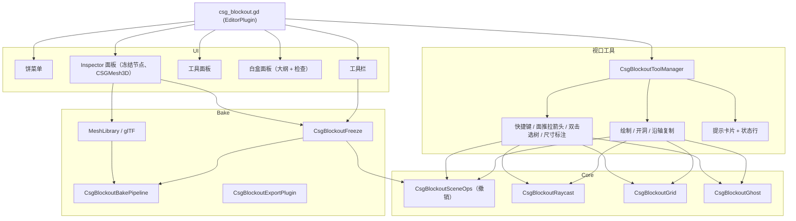

# CSG_Blockout 架构设计与技术内幕

*其他语言版本: [English](ARCHITECTURE.md) | [返回主文档](README_CN.md)*

本文档面向想了解 `CSG_Blockout` 内部实现、做二次开发或排查问题的开发者。

---

## 目录
- [1. 模块结构](#1-模块结构)
- [2. 视口输入与工具](#2-视口输入与工具)
- [3. 撤销：统一的操作构建器](#3-撤销统一的操作构建器)
- [4. 可逆烘焙（冻结）](#4-可逆烘焙冻结)
- [5. 射线求交与关卡检查](#5-射线求交与关卡检查)
- [6. 从这里试玩](#6-从这里试玩)
- [7. 管线导出](#7-管线导出)
- [8. Spreader：三维空间哈希网格](#8-spreader三维空间哈希网格)
- [9. 世界对齐的三平面网格着色器](#9-世界对齐的三平面网格着色器)
- [10. GDScript 2.0、导出安全与引擎版本](#10-gdscript-20导出安全与引擎版本)
- [11. 节点参考](#11-节点参考)
- [12. 设置参考](#12-设置参考)

---

## 1. 模块结构

`csg_blockout.gd`（`EditorPlugin`）只负责把各部分接起来，功能都在 `scripts/` 里：

| 目录 | 内容 |
| :--- | :--- |
| `scripts/core/` | 公共基础：可撤销的场景修改（`CsgBlockoutSceneOps`）、针对 CSG 的射线求交（`CsgBlockoutRaycast`）、栅格（`CsgBlockoutGrid`）、幽灵预览（`CsgBlockoutGhost`）、图元几何辅助（`CsgBlockoutShapeInfo`）、节点创建（`CsgBlockoutNodeFactory`）、选区辅助、可重绑的快捷键（`CsgBlockoutShortcuts`）以及引擎版本兼容层（`CsgBlockoutCompat`）。 |
| `scripts/tools/` | 视口工具：工具管理器、绘制（方块/房间）、开洞（门/窗）、面推拉、沿轴复制、键盘变换、从这里试玩。 |
| `scripts/bake/` | 冻结/解冻、烘焙管线（碰撞、UV2、遮挡体、LOD）、冻结节点的 Inspector 面板、导出插件、MeshLibrary 导出与 glTF 往返。 |
| `scripts/inspector/` | `CSGMesh3D` 的流形检查及其 Inspector 面板。 |
| `scripts/metrics/` | 尺寸标注、角色参照节点与 gizmo、关卡检查、语义标签。 |
| `scripts/outliner/` | 白盒停靠面板（大纲 + 检查页签）与语义命名。 |
| `scripts/runtime/` | 在游戏里运行的脚本：从这里试玩的启动场景与测试小人。它们不能引用任何编辑器类。 |
| `scripts/patterns/` | `CSGRepeater3D` 使用的 `CSGPattern` 资源。 |
| `scripts/i18n/` | 7 种界面语言的文案表，由 `CsgBlockoutI18n` 合并。 |
| `scripts/`（根目录） | 饼菜单、视口左侧的工具面板、工具栏、快捷键速查窗口、配置（`CsgBlockoutConfig`），以及自定义节点 `CSGRepeater3D`、`CSGSpreader3D`、`CSGStairs3D`、`CSGRuler3D`。工具面板和工具栏在代码里构建控件，没有对应的 `.tscn`。 |
| `benchmarks/` | 可复现的性能基准（[BENCHMARKS_CN.md](BENCHMARKS_CN.md)），不包含在资源商店的下载包里。 |

---

## 2. 视口输入与工具

插件常驻开启输入转发（`set_input_event_forwarding_always_enabled`），并在所有 3D 视口上层绘制叠加信息（`set_force_draw_over_forwarding_enabled`）。`_forward_3d_gui_input` 按以下顺序分发每个事件：

1. **饼菜单**：配置的修饰键 + `A` 打开；打开期间其他部分都收不到事件（`Esc` 关闭）。按住鼠标右键（飞行导航）时不会打开。
2. **HUD**：点击提示卡片上的按键和 **Esc**、点击状态行上的操作（"下一个 ›"），由工具管理器处理。
3. **鼠标右键**：始终交给 Godot 的自由视角。右键单击而没有移动时，会退出当前工具。
4. **当前的模态工具**（绘制、开洞、沿轴复制）：`Esc` 退出，其余事件它优先处理。
5. **被动工具**，按输入优先级：尺寸标注（`CsgBlockoutMeasureOverlay`，标注画在箭头上层，所以最先处理）、键盘变换与栅格键（`CsgBlockoutTransformHotkeys`）、面推拉箭头（`CsgBlockoutFaceDrag`）、双击选中整棵树（`CsgBlockoutTreeSelect`）。
6. 其余事件原样交还给 Godot。

工具继承 `CsgBlockoutTool`（`input`、`draw_overlay`、`cancel`、`chip`），返回 `PASS` 或 `STOP`。模态工具用一次就结束：产出一个结果后调用 `manager.finish()`，除非用户双击按钮锁定了工具。没有拖动的单击会结束工具并选中光标下的物体（`manager.select_at()`），所以工具不会"困住"鼠标。

`chip()` 给视口顶部的提示卡片提供内容：标题、下一步、以及工具接受的按键。反馈写在卡片下方的状态行（`CsgBlockoutStatus.report()`）：一句话，最多带一个可点击的操作，几秒后淡出。错误和之后还需要看到的警告会同时发到 Godot 的通知里。按键匹配的是注册在编辑器设置 `csg_blockout/` 下的快捷键；除了你自己绑定的"从这里试玩"键，其余快捷键只在选中白盒或工具激活时才会拦截。

预览（绘制幽灵、切割预览、复制副本、问题边）都是 `RenderingServer` 实例：不进场景树，不把场景标为已修改，也不产生撤销记录。重活都在松开鼠标时才做，拖动过程中只移动幽灵预览。

---

## 3. 撤销：统一的操作构建器

所有场景修改都经过 `CsgBlockoutSceneOps.Action`：它收集 `add_node`、`remove_node`、`reparent`、`set_property`、`assign_meta`、`rename`、`select` 等操作，作为一个 `EditorUndoRedoManager` 操作提交到当前场景的历史里（使用反向撤销顺序）。让撤销/重做可靠的那些细节都由它处理：

- **所有权**：连同子树一起添加的节点，owner 设为场景根；被删除后又被重做加回来的节点，恢复成原来确切的 owner。
- 撤销时恢复**选区**。
- **合并**：连续的微调会合并成一次撤销。

饼菜单、工具面板和所有工具都用它，所以创建、切割、推拉面、冻结和解冻的撤销方式完全一致。

---

## 4. 可逆烘焙（冻结）

冻结会把 CSG 根节点换成同名、同变换的 `MeshInstance3D`。撤销所需的一切都存在编辑器专用的元数据里（以 `_` 开头的元数据会被保存，但不在 Inspector 里显示）：

| 元数据 | 所在节点 | 内容 |
| :--- | :--- | :--- |
| `_csg_blockout_source` | 冻结节点 | CSG 子树打包成的 `PackedScene`（所有权已镜像，去掉了非 CSG 节点）。 |
| `_csg_blockout_bake` | 冻结节点 | 冻结时使用的烘焙选项。 |
| `_csg_blockout_generated` | 生成的子节点 | 标记 `Collision` 和 `Occluder`，重新烘焙时据此替换。 |
| `_csg_blockout_home` | 非 CSG 节点 | 灯光、标记点原本在 CSG 树里的位置（相对根节点的路径）。 |
| `_csg_blockout_shell` | 解冻后的 CSG 根节点 | 去掉生成内容后的冻结节点（脚本、分组、层、用户加的子节点），下次冻结时复用。 |
| `_csg_blockout_gltf` | 冻结节点 | glTF 导出记录：文件、文件修改时间、材质名对照表。 |
| `_csg_blockout_refined` | 冻结节点 | 正在使用 glTF 往返的精修网格时存在。 |

**冻结**：先等一帧让待处理的 CSG 更新完成；通过 `CsgBlockoutBakePipeline` 烘焙（复制一份 `CSGShape3D.bake_static_mesh()` 的结果，再按配置生成碰撞、UV2、遮挡体和 LOD）；打包源数据；把非 CSG 节点挂到冻结节点下；冻结节点先用临时名字加入，删掉 CSG 根节点后再接管原名，全部在一次操作里完成。树外指向树内的 NodePath 引用在每次操作里只收集一遍，并给出提示。

**解冻**：在冻结节点当前的变换处实例化保存的源数据，把冻结节点存成外壳，再把非 CSG 节点放回原位。

**重新烘焙**：在冻结节点旁边实例化保存的源数据，放在渲染层 0（参与计算但从不绘制），等它构建完成后按新选项烘焙，在一次操作里替换网格和生成的子节点。正在使用的精修网格会被丢弃。

**导出**：`CsgBlockoutExportPlugin._customize_scene` 会从导出的场景里去掉上面所有元数据，并删除编辑器专用的辅助节点（标尺、角色参照），除非关掉了 `bake/strip_source_on_export`。

---

## 5. 射线求交与关卡检查

工具需要精确命中 CSG，而编辑器里的 CSG 没有物理体。`CsgBlockoutRaycast.cast()` 的做法是：

1. 用 `RenderingServer.instances_cull_ray` 找出射线沿途的候选实例（只看包围盒）。
2. 对每个候选的 CSG 根节点或 `MeshInstance3D`（包括冻结的白盒），用它当前的网格构建 `TriangleMesh`，按节点缓存，网格变化时重建（CSG 根节点每次重建都会换一份新网格），在局部空间求交。法线会翻转到朝向射线的一侧。
3. 返回命中点、法线和被命中的节点；命中 CSG 时还会给出表面离命中点最近的图元（命中切割面时，另给出最近的实体图元）。什么都没打中时，退回到地平面（y = 0）。

**关卡检查**（`CsgBlockoutValidator`）读取每个 CSG 根节点的三角形：
- **坡度**：倾角介于可行走角度（`max_slope_angle`）与 80° 之间的面（更陡的算墙）。
- **天花板**：在世界对齐的 0.5 m 栅格上对可行走面采样，从每个采样点向上打射线。天花板低于站立高度标橙色，低于蹲伏高度标红色。被实体覆盖的采样点（比如坡道下面的地板）会被跳过：这时采样点上方的第一个面朝上。面的朝向根据 `face_index` 由三角形的绕序重新计算，因为 `TriangleMesh` 不保证法线朝向。比胶囊半径还窄的窄台（比如窗台）上的采样点也会跳过：在 X 和 Z 方向各偏开半个胶囊半径向下打射线，每个方向至少一侧要在差不多的高度找到地面。
- 问题按"形成天花板的图元 + 类型"分组，在视口里高亮，并列在检查页签里。

---

## 6. 从这里试玩

1. 编辑器找出出生点（视口中心或光标处的射线命中点）和相机朝向，把场景路径、出生点、角色参数和本地化的 HUD 文字写进 `user://csg_blockout/play_here.json`。
2. 用 `EditorInterface.play_custom_scene()` 启动插件自带的启动场景（遵循"运行前保存"设置）。
3. 启动场景（`scripts/runtime/`）把请求的场景加载为当前场景；没开 `use_collision` 的可见 CSG 根节点临时打开，没有碰撞体的冻结白盒临时补一个三角网格碰撞（只影响这一次运行，编辑器在状态行报告补了几块）；场景里没有太阳和天空时补一个；再生成 `CSGBlockoutTestPawn`。
4. 测试小人是一个直接读物理按键的 `CharacterBody3D`，所以项目的输入映射和自动加载都不受影响。它的数值全部来自角色参数：跳跃初速 `v = √(2·g·h)` 由 `single_jump_height` 推出；冲刺速度 = `sprint_jump_distance` ÷ 滞空时间（`2v / g`）；行走速度不超过冲刺速度；走不上比 `max_slope_angle` 更陡的坡；蹲下后起身前会检查头顶空间。

---

## 7. 管线导出

- **MeshLibrary**（`CsgBlockoutMeshLibraryExport`）：每个 CSG 根节点或冻结节点一个条目，以节点命名，网格在节点局部空间，碰撞按它的烘焙选项生成（这里"自动"一律当作三角网格），预览图由 `EditorInterface.make_mesh_previews` 渲染。已有的库从资源缓存里加载，正在使用它的 GridMap 会立即刷新；条目按名字匹配并保留原 ID。
- **glTF 往返**（`CsgBlockoutGltfRoundTrip`）：用 `GLTFDocument` 把冻结网格写成一个以冻结节点命名的单节点。每个表面都带具名材质（`ShaderMaterial` 换成纯色替身），并记录"名字 → 材质"对照表。点"用精修网格替换"时，不经缓存加载重新导入的场景，把其中的网格按材质合并（只有一个网格时直接使用），材质名与记录对得上的表面换回原来的 Godot 材质（兼容 Blender 的 `.001` 后缀）。是否被外部修改，通过比较文件修改时间与记录值判断。
- **流形检查**（`CsgBlockoutManifoldCheck`）：先按位置焊接顶点（与 Godot 的 CSG 一致），再统计每条边：只被一个面使用 → 开放边；被两个以上面使用 → 非流形边；被两个面以相同方向走过 → 朝向相反。结果按网格缓存，网格变化时失效。

---

## 8. Spreader：三维空间哈希网格

`CSGSpreader3D` 让撒放的副本彼此至少相距 `min_distance`。把每个候选点和所有已放置的点逐一比较是 $\mathcal{O}(N^2)$；这里改为把点存进以 `Vector3i` 单元格为键的 `Dictionary`：

1. **单元格尺寸** $= d_{\min}$。距离小于 $d_{\min}$ 的两个点，在任一轴上最多相差一个单元格。
2. **量化**：$\text{cell} = (\lfloor x/d_{\min} \rfloor, \lfloor y/d_{\min} \rfloor, \lfloor z/d_{\min} \rfloor)$。
3. **27 邻域**：候选点只需和自身所在单元格及周围 26 个单元格里的点比较，每次检查是 $\mathcal{O}(1)$。

候选点在 `Shape3D` 内用拒绝采样生成，超过 `max_placement_attempts` 次就放弃；副本上限 200 个。

---

## 9. 世界对齐的三平面网格着色器

`grid_triplanar.gdshader`：
1. **世界空间三平面映射**：不用 UV，按世界坐标画网格，所以无论缩放、旋转还是布尔切割，1 m 的格子都还是 1 m。
2. **抗锯齿**：用 `fwidth()` 与 `smoothstep()` 让网格线在任何距离下都干净、没有摩尔纹。
3. **不用贴图**：全部程序化生成；语义标签的颜色只是不同的 `color_a` / `color_b` 参数。

---

## 10. GDScript 2.0、导出安全与引擎版本

- **全面静态类型**：每个变量、参数、返回值都有类型。
- **导出安全**：可能在游戏里运行的脚本（`CSGRepeater3D`、`CSGSpreader3D`、`CSGStairs3D`、`CSGRuler3D`、`CSGPlayerReference3D`、runtime 目录）从不直接写出编辑器专用类名。需要编辑器时，通过 `Engine.get_singleton(&"EditorInterface")` 获取，并用 `Engine.is_editor_hint()` 把关；否则导出后的游戏会编译失败。
- **引擎版本**：插件支持 Godot 4.6+。不同版本间有差异的调用（`EditorDock`、快捷键注册、文件对话框选项）统一走 `CsgBlockoutCompat`。

---

## 11. 节点参考

### CSGRepeater3D

| 属性 | 类型 | 默认值 | 说明 |
| :--- | :--- | :--- | :--- |
| `template_node` | `Node3D` | `null` | 作为模板的场景树节点。 |
| `template_node_scene` | `PackedScene` | `null` | 模板场景，`template_node` 为空时使用。 |
| `hide_template` | `bool` | `true` | 显示副本时隐藏模板节点。 |
| `pattern` | `CSGPattern` | `null` | 排列方式：`CSGGridPattern`、`CSGCircularPattern`、`CSGSpiralPattern` 或 `CSGNoisePattern`。 |
| `position_jitter` | `float` | `0.0` | 随机位置偏移。 |
| `random_seed` | `int` | `0` | 所有随机量的种子。 |
| `estimated_instances` | `int` | `0` | （只读）排列会生成多少个副本。 |
| `randomize_rotation` | `bool` | `false` | 开启随机旋转。 |
| `randomize_rot_x/y/z` | `bool` | `false` | 逐轴旋转开关。 |
| `rotation_variance_x/y/z_deg` | `float` | `0.0` | 最大随机角度（度，0 表示完整 360°）。 |
| `randomize_scale` | `bool` | `false` | 开启随机缩放。 |
| `scale_variance` | `float` | `0.0` | 统一缩放的变化幅度。 |

### CSGSpreader3D

| 属性 | 类型 | 默认值 | 说明 |
| :--- | :--- | :--- | :--- |
| `template_node` | `Node3D` | `null` | 要撒放的节点。 |
| `spread_area_3d` | `Shape3D` | `null` | 撒放范围（方块、球体、胶囊、网格……）。 |
| `max_count` | `int` | `10` | 副本数量（上限 200）。 |
| `noise_threshold` | `float` | `0.5` | 噪声密度阈值（0.0 到 1.0）。 |
| `seed` | `int` | `0` | 随机种子。 |
| `avoid_overlaps` | `bool` | `false` | 让副本彼此至少相距 `min_distance`（空间哈希网格）。 |
| `min_distance` | `float` | `1.0` | 副本之间的最小距离。 |
| `max_placement_attempts` | `int` | `100` | 每个副本放弃前的尝试次数。 |
| `allow_rotation` | `bool` | `false` | 绕 Y 轴随机旋转。 |
| `allow_scale` | `bool` | `false` | 随机缩放（0.5 到 2 倍）。 |

### CSGStairs3D

一个 `CSGPolygon3D`，轮廓由下列属性生成：台阶沿 +Y 升高、沿 +X 向前，轮廓沿 -Z 挤出 `width` 的宽度。

| 属性 | 类型 | 默认值 | 说明 |
| :--- | :--- | :--- | :--- |
| `step_count` | `int` | `8` | 台阶数（1 到 100）。 |
| `total_height` | `float` | `2.0` | 总高度（米），沿 +Y。 |
| `total_depth` | `float` | `3.0` | 总进深（米），沿 +X。 |
| `width` | `float` | `1.5` | 楼梯宽度（米），沿 -Z 挤出。 |
| `is_ramp` | `bool` | `false` | 用平滑坡面代替台阶。 |
| `enable_ergonomic_warning` | `bool` | `true` | 踏步高度不在 0.15–0.20 m、踏步深度不在 0.25–0.30 m 的舒适范围时给出提示。 |
| `step_height` | `float` | `0.25` | （只读）`total_height / step_count`。 |
| `step_depth` | `float` | `0.375` | （只读）`total_depth / step_count`。 |
| `ergonomic_status` | `String` | `""` | （只读）人体工学判定文字。 |

### CSGRuler3D

| 属性 | 类型 | 默认值 | 说明 |
| :--- | :--- | :--- | :--- |
| `target_point` | `Vector3` | `Vector3(0, 0, -3)` | 第二个端点，相对标尺自身。 |
| `use_global_metrics` | `bool` | `true` | 使用项目的角色参数，而不是下面的覆盖值。 |
| `character_height` | `float` | `1.8` | 覆盖值：角色身高。 |
| `single_jump_height` | `float` | `1.5` | 覆盖值：跳跃能够到的最高台面。 |
| `sprint_jump_distance` | `float` | `4.0` | 覆盖值：冲刺跳跃的最远距离。 |
| `total_distance` | `float` | `3.0` | （只读）三维距离。 |
| `horizontal_distance` | `float` | `3.0` | （只读）水平跨度。 |
| `vertical_delta` | `float` | `0.0` | （只读）高度差。 |
| `is_jump_reachable` | `bool` | `true` | （只读）目标能否跳到。 |
| `reachability_status` | `String` | `"Reachable"` | （只读）本地化的判定文字。 |

### CSGPlayerReference3D

只在编辑器里存在（游戏运行时与导出时会被移除）。gizmo 画出胶囊体、蹲伏与视线高度、跳跃能够到的最高台面、冲刺跳跃弧线（前方为 -Z）和最大可行走坡度。

| 属性 | 类型 | 默认值 | 说明 |
| :--- | :--- | :--- | :--- |
| `use_global_metrics` | `bool` | `true` | 使用项目的角色参数，而不是下面的覆盖值。 |
| `character_height` | `float` | `1.8` | 覆盖值：站立高度。 |
| `capsule_radius` | `float` | `0.35` | 覆盖值：胶囊半径。 |
| `crouch_height` | `float` | `1.0` | 覆盖值：蹲伏高度。 |
| `single_jump_height` | `float` | `1.5` | 覆盖值：跳跃能够到的最高台面。 |
| `sprint_jump_distance` | `float` | `4.0` | 覆盖值：冲刺跳跃的最远距离。 |
| `max_slope_angle` | `float` | `45.0` | 覆盖值：最大可行走坡度（度）。 |
| `show_jump_arc` | `bool` | `true` | 画出冲刺跳跃弧线。 |
| `show_slope` | `bool` | `true` | 画出坡度楔形。 |

---

## 12. 设置参考

### 项目设置（`addons/csg_blockout/*`）

| 设置 | 类型 | 默认值 | 说明 |
| :--- | :--- | :--- | :--- |
| `action_key` | `int`（按键） | `KEY_SHIFT` | 与 `A` 组合打开饼菜单的修饰键。 |
| `language_override` | `String` | `"auto"` | 界面语言（`auto`、`en`、`zh_CN`、`ja`、`ko`、`es`、`pt`、`ru`）。 |
| `material_preset` | `int`（枚举） | `1`（灰白网格） | 当前的网格材质预设。 |
| `custom_material_path` | `String` | `""` | 自定义预设使用的材质。 |
| `player_metrics/character_height` | `float` | `1.8` | 站立高度（米）。 |
| `player_metrics/single_jump_height` | `float` | `1.5` | 跳跃能够到的最高台面（米）。 |
| `player_metrics/sprint_jump_distance` | `float` | `4.0` | 冲刺跳跃的最远距离（米）。 |
| `player_metrics/capsule_radius` | `float` | `0.35` | 角色胶囊半径（米）。 |
| `player_metrics/crouch_height` | `float` | `1.0` | 蹲伏高度（米）。 |
| `player_metrics/max_slope_angle` | `float` | `45.0` | 最大可行走坡度（度）。 |
| `player_metrics/walk_speed` | `float` | `3.5` | 测试小人的行走速度（米/秒，不超过冲刺速度）。 |
| `room/wall_thickness` | `float` | `0.25` | 绘制房间的墙厚（米）。 |
| `room/floor_thickness` | `float` | `0.25` | 绘制房间的地板厚度（米）。 |
| `room/open_top` | `bool` | `true` | 绘制的房间不带顶。 |
| `room/height` | `float` | `3.0` | 绘制的房间高度（米）。 |
| `openings/door_size` | `Vector2` | `(1.0, 2.1)` | 门的宽和高（米）。 |
| `openings/window_size` | `Vector2` | `(1.2, 1.2)` | 窗的宽和高（米）。 |
| `openings/window_sill_height` | `float` | `0.9` | 窗台离地高度（米）。 |
| `openings/add_frame` | `bool` | `false` | 新开的洞口带框（工具里按 `F` 切换）。 |
| `openings/frame_width` | `float` | `0.1` | 门框/窗框宽度（米）。 |
| `bake/collision` | `String`（枚举） | `"auto"` | 新冻结的默认碰撞：`auto`、`none`、`trimesh`、`primitives`、`convex`。 |
| `bake/lightmap_uv2` | `bool` | `false` | 冻结时生成光照贴图 UV2。 |
| `bake/lightmap_texel_size` | `float` | `0.2` | UV2 展开的纹素尺寸。 |
| `bake/occluder` | `bool` | `false` | 冻结时生成 `OccluderInstance3D`。 |
| `bake/lod` | `bool` | `false` | 冻结时生成 LOD。 |
| `bake/strip_source_on_export` | `bool` | `true` | 导出时去掉保存的 CSG 和编辑器专用辅助节点。 |

### 编辑器设置
- **快捷键**，位于 `csg_blockout/` 下：`grid_smaller`、`grid_bigger`、`nudge_left`、`nudge_right`、`nudge_forward`、`nudge_back`、`nudge_up`、`nudge_down`、`drop_to_surface`、`rotate_ccw`、`rotate_cw`、`array_duplicate`、`play_here`。
- **按项目保存的编辑器状态**存在编辑器设置的项目元数据里（属于个人设置，不会写进 `project.godot`），分区 `csg_blockout`：`grid_size`、`grid_snap`、`show_dimensions`、`mesh_library_path`、`draw_box_height`（新方块的高度：上一个画出的方块的高度，调整那个方块时随之更新）。
- 旧版本的 `auto_hide` 和 `default_operation` 项目设置已移除，插件加载时会从 `project.godot` 里清掉。
