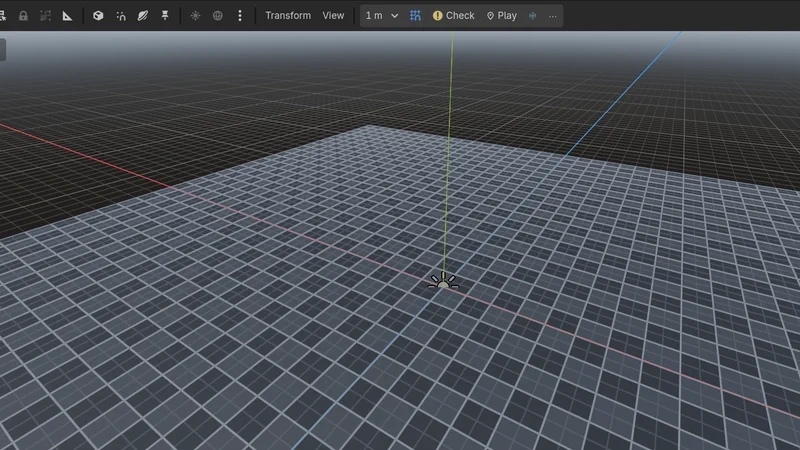

<div align="center">
  <picture>
    <source media="(prefers-color-scheme: dark)" srcset="res/icon_transparent.svg" />
    
  </picture>
  <h1>CSG_Blockout</h1>

  <p>
    <a href="README.md"></a>
    <a href="README_CN.md"></a>
    <a href="TUTORIAL_EN.md"></a>
    <a href="ARCHITECTURE.md"></a>
  </p>

  <p>
    <a href="https://godotengine.org"></a>
    <a href="https://store.godotengine.org/asset/qwqzhanqwq/csg-blockout/"></a>
    <a href="LICENSE"></a>
  </p>

  <p>
    <strong>Level prototyping, not modeling.</strong><br />
    Block out levels in Godot 4.6+ with native CSG nodes: draw rooms in the viewport, check them against your character, play them, and freeze them into meshes you can always turn back into CSG.
  </p>

  
</div>

---

## Why CSG?

Brush-based level editors keep their geometry in their own data format. CSG_Blockout doesn't: everything you build is a regular Godot CSG node in your scene tree, edited non-destructively. Move a wall, resize a doorway, or delete a cut at any time; nothing gets collapsed into a mesh behind your back.

When a room is done, **freeze** it: it becomes a plain `MeshInstance3D` with collision that loads and runs like any other mesh, while the CSG it came from stays stored inside the node. **Unfreeze** brings that CSG back exactly as it was, so "baked" never means "final".

You can also walk away from the plugin at any time:

- **Primitives** are stock `CSGBox3D`, `CSGCylinder3D`, etc. Disabling or removing the plugin doesn't touch them.
- **Frozen blockout** is a regular `MeshInstance3D` + `StaticBody3D`. Only unfreezing needs the plugin.
- **Stairs** (`CSGStairs3D`) fall back to a plain `CSGPolygon3D` with the same shape.
- **Repeater / Spreader** instances are live previews. Click **Bake** first and they become ordinary scene nodes.
- **Grid materials** live in the plugin folder. Disabling the plugin keeps them; deleting the folder doesn't.

---

## Installation

### Option 1: Godot AssetLib (Recommended)
1. Open Godot (4.6 or later) and navigate to the **AssetLib** tab at the top of the editor.
2. Search for `CSG Blockout`, download, and install it into your project.
3. Or view it directly on the web: [Godot AssetLib - CSG_Blockout](https://store.godotengine.org/asset/qwqzhanqwq/csg-blockout/).

### Option 2: GitHub Releases (.zip)
1. Download the latest release `.zip` from the [Releases page](https://github.com/qwqzhanqwq/Godot-CSG-Blockout/releases).
2. Extract the archive and copy the `addons/csg_blockout` directory into your Godot project's `addons/` folder.

### Option 3: Git Clone
Clone the repository directly into your project's `addons/` directory:
```bash
git clone https://github.com/qwqzhanqwq/Godot-CSG-Blockout.git addons/csg_blockout
```

### Enable the Plugin
In Godot, go to **Project -> Project Settings -> Plugins**, find **CSG_Blockout**, and check the **Enable** checkbox.

---

## Quick Start

1. **Draw a room**: click **Room** in the tool palette on the left of the viewport (or press `Shift + A` and pick it from the pie menu), then drag the floor outline on the ground. Releasing the mouse builds the room.
2. **Cut a doorway**: click **Door**, then click a wall. The cut is aligned to the wall, goes through its full thickness and sits on the floor.
3. **Shape it**: drag the arrows on a selected shape's faces to push or pull them, or click a dimension label and type a size. The arrow keys nudge by one grid step and `[` / `]` change the grid size.
4. **Check the scale**: add a **Player Reference** to see your character's capsule, jump height and sprint-jump arc, then click **Check** in the toolbar. Steep slopes and low ceilings are highlighted, and **Next ›** takes you from one to the next.
5. **Play it**: click **Play** to drop a first-person test character at the spot you're looking at. It jumps as high and as far as your player metrics say.
6. **Freeze it**: click **Freeze** when the room is done. Unfreeze it whenever you want to change it again.

Every tool does one thing and hands control back, and the card at the top of the viewport always says what the next step is. Double-click a tool to keep it on; `Esc` or a right-click leaves it. **⋯ › Shortcuts** lists every key.

> The full walkthrough, including freezing, MeshLibrary/glTF export and the procedural tools, is in the [tutorial (TUTORIAL_EN.md)](TUTORIAL_EN.md).

---

## Features

### Build
- **Draw in one drag**: drag a base on any surface or the ground and release; the box gets the height you used last. **Cut** drags an opening into a surface and cuts through it; the cut lands in the CSG tree it was drawn on (a lone wall is wrapped into a combiner automatically). **Room** makes a hollow shell with configurable wall thickness.
- **Doors and windows**: click a wall to cut a doorway or a window at sill height, with an optional frame (`F`). Sizes are in Project Settings.
- **Face arrows and typed sizes**: a selected box, cylinder or stairs shows an arrow on each face toward you; drag it to push or pull that face while the opposite one stays put. Click a dimension label to type an exact size.
- **Grid and snapping**: one grid (0.125–8 m) for every tool, keyboard nudging, rotation in 15° steps, drop to the surface below, duplicate along an axis (`Ctrl + Shift + D`).
- **Tool palette and pie menu**: the palette on the left of the viewport is always there, with named tools, shapes, the operation of the selected shapes, materials and helpers. `Shift + A` opens the same tools as a pie menu at the cursor. Double-click a shape to select its whole CSG tree.
- **Stairs and ramps** (`CSGStairs3D`): set height, depth, width and step count, or switch to a smooth ramp. Warns when steps are uncomfortable.
- **Grid materials that never stretch**: world-aligned 1 m grid in light, dark and orange, batch-applied to the selection.

### Measure and test
- **Dimension labels** for selected shapes, in meters.
- **Player reference** (`CSGPlayerReference3D`): capsule, crouch and eye height, the height you can jump onto, the sprint-jump arc and the steepest walkable slope. Editor-only.
- **Level check**: flags walkable slopes that are too steep and ceilings below standing or crouch height, highlighted in the viewport and listed in the outliner's Checks tab.
- **Jump check and ruler**: select two objects to see whether the gap is jumpable, or drag a ruler between any two points.
- **Semantic tags**: mark shapes as wall, floor, hazard or interactive. They get color-coded grid materials and metadata your game can read, and you can export an SVG legend for design docs.
- **Play From Here**: run the scene with a first-person test character (WASD, jump, sprint, crouch) at the viewport center or the cursor. Blockout without collision gets it for the run, so you never fall through. No input map changes, no autoloads.

### Organize
- **Blockout outliner** (dock tab): only CSG trees and frozen blockout, with operation icons, show/hide, solo, lock, filter, group/ungroup, and semantic names like `Wall_Corridor_01`.

### Freeze and ship
- **Reversible bake**: freeze CSG trees into meshes with collision as one undo step; unfreeze them back into editable CSG. Scripts, groups and children you add to a frozen node survive the round trip.
- **Bake options**: collision (none, trimesh, native shape per primitive, convex hull), lightmap UV2, occluder and LODs, per node, with an in-place **Rebake**.
- **Zero runtime cost**: exports strip the stored CSG and the editor-only helpers, so frozen blockout ships as plain meshes.
- **Export to MeshLibrary** for GridMap, with collision and previews; exporting again updates the library in place.
- **glTF round trip**: export frozen blockout as `.glb`, refine it in Blender, and swap the refined mesh in; your Godot materials come back by name.
- **Non-manifold warning** for `CSGMesh3D`: Godot's CSG quietly fails on meshes that aren't closed, so the Inspector points out the problem edges.

### Procedural extras
- **Repeater** (`CSGRepeater3D`): copies in grid, circle, spiral or noise patterns, with random rotation, scale and jitter.
- **Spreader** (`CSGSpreader3D`): scatter up to 200 copies inside any `Shape3D` without overlaps.

### Everything else
- Every scene edit is undoable with `Ctrl + Z` / `Ctrl + Y`, including freezing and unfreezing.
- Interface in 7 languages: English, Simplified Chinese, Japanese, Korean, Spanish, Portuguese and Russian.

---

## Shortcuts

All viewport shortcuts can be rebound in **Editor Settings > Shortcuts > csg_blockout**.

| Action | Default |
| :--- | :--- |
| Pie menu | `Shift + A` (modifier set in Project Settings) |
| Keep a tool on | Double-click its button |
| Grid smaller / bigger | `[` / `]` |
| Nudge one grid step | Arrow keys (horizontal, relative to the view), `Page Up` / `Page Down` (vertical); `Shift` for a quarter step |
| Rotate 15° (`Shift`: 90°) | `,` / `.` |
| Drop onto the surface below | `End` |
| Duplicate along an axis | `Ctrl + Shift + D` |
| Push/pull a face | Drag the arrow on the face |
| Exact size | Click a dimension label, type, `Enter` |
| Select the whole CSG tree | Double-click a shape |
| Draw a box as a separate object | Hold `Shift` while drawing |
| Play From Here at the cursor | Unbound (assign one if you like) |
| Leave a tool | `Esc` or right-click |

The same list is in the editor under **⋯ › Shortcuts**.

---

## Performance

- **Split big levels into one CSG tree per room.** Godot only rebuilds the tree that changed: an edit costs about 2 ms per room-sized tree no matter how big the level is, against about 30 ms when 400 primitives share one tree.
- **Freezing is effectively instant**: under 0.1 s for 400 primitives.
- **Live CSG costs nothing per frame, only at load time**: a 400-primitive level starts about 4× faster frozen.

Numbers, method and a benchmark you can run yourself: [BENCHMARKS.md](BENCHMARKS.md).

---

## Contributing

Bug reports, feature requests, and pull requests are welcome. Please read [CONTRIBUTING.md](CONTRIBUTING.md) first. Release notes are in [CHANGELOG.md](CHANGELOG.md).

---

## Relationship to CSG Toolkit

This plugin originated from the open-source [CSG Toolkit](https://godotengine.org/asset-library/asset/3057) by **LuckyTepot**, which proved the value of in-viewport CSG authoring. `CSG_Blockout` is a ground-up rewrite by [qwqzhanqwq](https://github.com/qwqzhanqwq) for Godot 4.6+:

| | Original CSG Toolkit | CSG_Blockout |
| :--- | :--- | :--- |
| **Engine** | Early Godot 4.x | Godot 4.6+, fully statically typed GDScript |
| **Creating shapes** | Viewport sidebar | Draw in one drag, pie menu at the cursor, tool palette |
| **Editing** | Godot gizmos | Face arrows, typed sizes, shared grid and snapping, keyboard nudging, duplicate along an axis |
| **Level design aids** | — | Doors/windows, stairs, dimension labels, player reference, level check, jump check, ruler, Play From Here |
| **Baking** | — | Reversible freeze with collision/UV2/occluder/LOD options; MeshLibrary and glTF export |
| **Organization** | — | Blockout outliner with solo, lock and semantic names |
| **Materials** | Default materials | World-aligned grid materials, semantic tag colors |
| **Procedural layout** | — | Repeater and overlap-free Spreader, bakeable to regular nodes |
| **Undo** | Basic | Every scene edit is undoable, including freezing |
| **Languages** | English | 7 languages |

---

## Documentation

### English
- [Main Documentation (README.md)](README.md): Overview, installation, and features.
- [Tutorial (TUTORIAL_EN.md)](TUTORIAL_EN.md): From an empty scene to a frozen, playable level, plus the export and procedural tools.
- [Architecture & Technical Internals (ARCHITECTURE.md)](ARCHITECTURE.md): Module layout, how the tools and freezing work, and the property and settings reference.
- [Benchmarks (BENCHMARKS.md)](BENCHMARKS.md): Editing, freezing and runtime numbers, with a reproducible benchmark.
- [Changelog (CHANGELOG.md)](CHANGELOG.md): What changed in each release.
- [Contributing Guide (CONTRIBUTING.md)](CONTRIBUTING.md): How to report bugs and submit pull requests.

### 简体中文 (Simplified Chinese)
- [中文主说明文档 (README_CN.md)](README_CN.md)：定位、安装与功能。
- [教程 (TUTORIAL_CN.md)](TUTORIAL_CN.md)：从空场景到可试玩、已冻结的关卡，以及导出与程序化工具。
- [架构设计与技术内幕 (ARCHITECTURE_CN.md)](ARCHITECTURE_CN.md)：模块结构、工具与冻结的实现、属性与设置参考。
- [性能基准 (BENCHMARKS_CN.md)](BENCHMARKS_CN.md)：编辑、冻结与运行时的实测数据和可复现的基准脚本。
- [贡献指南 (CONTRIBUTING_CN.md)](CONTRIBUTING_CN.md)：如何反馈问题与提交 PR。

---

## Credits & License

- **Original Concept & Layout Design**: [LuckyTepot](https://github.com/LuckyTepot) (CSG Toolkit, Copyright (c) 2023).
- **Architecture Overhaul, 3D Pie Menu, Level Prototyping Tools, Reversible Bake, Spatial Hash Grid, Array/Scatter Systems, Stairs & Ruler, GDScript 2.0 Rewrite**: [qwqzhanqwq](https://github.com/qwqzhanqwq) (Copyright (c) 2026).
- **Contributors**: [SuzukaDev](https://github.com/SuzukaDev) (pie menu fly-navigation fix).

Licensed under the [MIT License](LICENSE).
