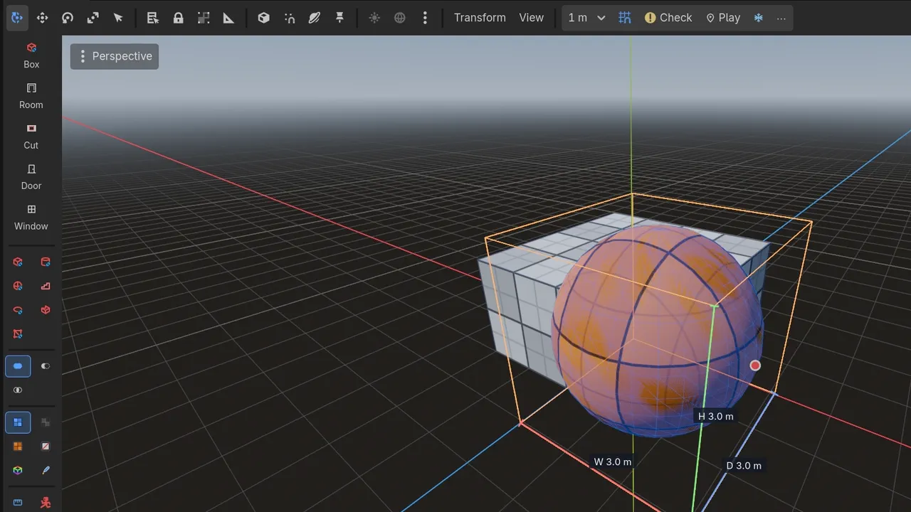
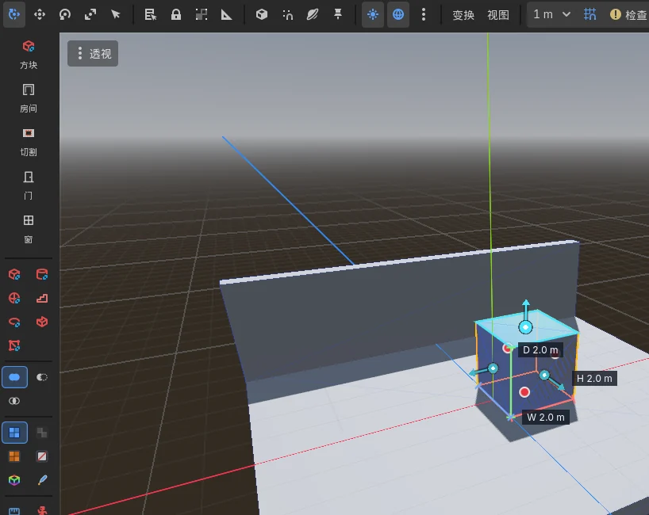
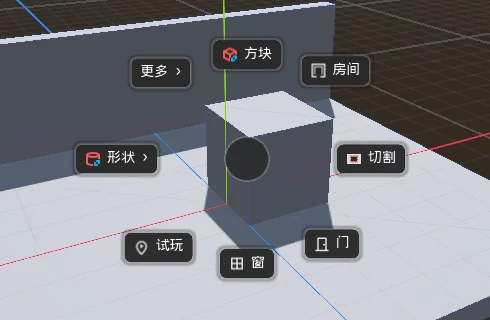
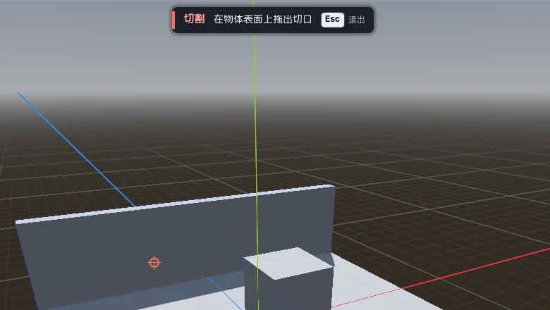
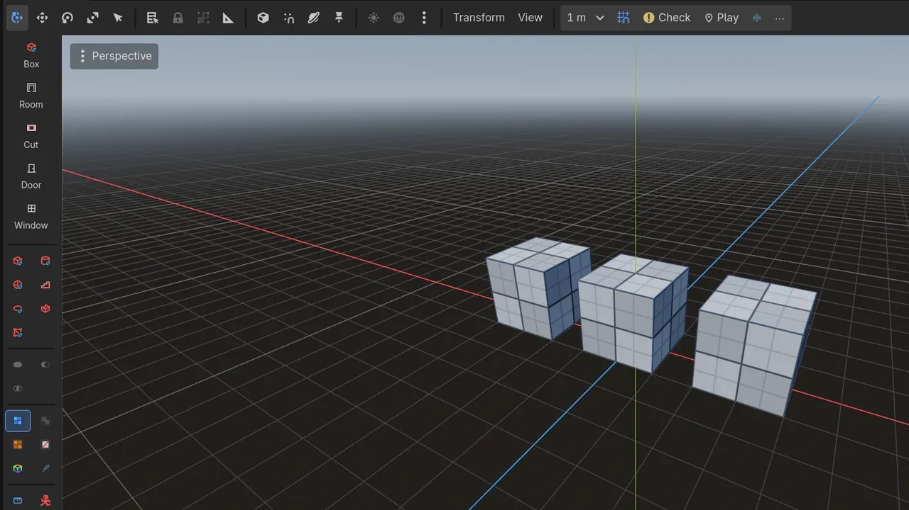

# CSG Blockout 教程：从空场景到可试玩、已冻结的关卡

*其他语言版本：[English](TUTORIAL_EN.md) | [返回主文档](README_CN.md) | [架构与技术内幕](ARCHITECTURE_CN.md)*

## 目录
- [1. 基础：理解 CSG](#1-基础理解-csg)
- [2. 搭一个房间](#2-搭一个房间)
- [3. 度量与试玩](#3-度量与试玩)
- [4. 冻结：可逆烘焙](#4-冻结可逆烘焙)
- [5. 接入正式管线](#5-接入正式管线)
- [6. 程序化工具：Repeater 与 Spreader](#6-程序化工具repeater-与-spreader)

---

## 1. 基础：理解 CSG

**CSG（构造实体几何）** 用简单图元（立方体、圆柱、球体）加三种布尔运算组合出形状：
- **并集**：把几个形状合成一个实体。
- **交集**：只保留形状互相重叠的部分。
- **差集**：从一个形状里挖掉另一个形状，门、窗、隧道都是这样做出来的。

在 Godot 里，`CSGCombiner3D`（或任何 CSG 父节点）下的所有 CSG 节点会合成一个结果。这样一组 CSG 中最上层的那个节点叫**根节点**，Godot 为每个根节点计算一份网格和一份碰撞。全程都可以修改，不存在"转换之后就改不了"的那一步。

---

## 2. 搭一个房间

### 工具面板与饼菜单
视口左侧的工具面板始终显示。从上到下依次是：绘制工具 **方块**、**房间**、**切割**、**门**、**窗**；各种图元；选中形状的布尔运算；网格材质；以及关卡辅助工具（标尺、角色参照）。`Shift + A` 会在光标处以饼菜单的形式打开同一套工具，另外还有 **试玩**、**形状 ›** 和 **更多 ›**（冻结、沿轴复制、对齐栅格、改运算、角色参照）。

每个工具做完一件事就交还控制：画一个方块、挖一个门洞，然后就回到选择状态。**双击** 工具按钮可以连续使用。工具开着时，视口顶部的小卡片会写出工具名、下一步该做什么以及能用的按键；按 `Esc`、右键或点卡片上的 **Esc** 退出。

### 画房间或方块
1. 点 **房间**（或 **方块**），在地面或任意表面上拖出底面，幽灵预览会显示结果和尺寸。
2. 松开即完成：房间的高度取自项目设置（`addons/csg_blockout/room/height`），方块沿用你上一个方块的高度（一开始是 1 m）。
3. 只点击不拖动，就是选中光标下的物体并退出工具。

**房间** 是一个独立的 `CSGCombiner3D`，里面是一个外壳盒和从中挖掉的内腔。墙厚、地板厚度和是否开顶在项目设置的 `addons/csg_blockout/room` 下。

在 CSG 表面上画的方块会加入那个表面所在的树（与它合并）；画在空地上则放在场景根下。绘制时按住 `Shift` 可以强制作为独立物体。

### 挖门窗与开口
- 点 **门** 或 **窗**，悬停在墙上点击。洞口会对齐墙面，贯穿实测的墙厚；门的底边落到地面，窗户按窗台高度摆放。按 `F` 加门框。尺寸在项目设置的 `addons/csg_blockout/openings` 下。
- 其他任意开口用 **切割**：在表面上拖出轮廓，松开就会笔直切穿。切割体会放进它所画在的那棵 CSG 树；如果被切的是一面单独的墙，会自动用一个新组合器把它包起来。

### 调整与排布
- **面上的箭头**：选中的方块、圆柱或楼梯，在朝向你的每个面上都有一个箭头。拖动箭头即可推拉这个面，对面保持不动，被拖的面落在栅格线上。每次拖动是一步撤销。
- **输入尺寸**：选中形状的宽、高、深标注可以点击。点一下，输入尺寸（`2.5`、`2,5`、`2.5 m` 都可以），按回车；底面保持不动。
- **整棵树**：单击选中光标下的图元，双击选中它所在的整棵 CSG 树。
- **运算**：面板上的并集、差集、交集按钮直接修改选中的形状，并亮起它们当前的运算。没有隐藏的"当前运算模式"：新形状一律是并集。
- **栅格**：`[` / `]` 切换所有工具共用的栅格尺寸（0.125–8 m）；工具栏尺寸旁边的开关可以关掉吸附（拖动时按住 `Ctrl` 临时反转）。
- **键盘**：方向键沿最接近视线的水平轴移动一个栅格步长，`Page Up` / `Page Down` 上下移动（按住 `Shift` 为四分之一步长），`,` / `.` 旋转 15°（`Shift`：90°），`End` 把选中物体落到下方表面。
- **沿轴复制**：按 `Ctrl + Shift + D`，沿 X、Y 或 Z 方向移动鼠标即可按选中物体自身的尺寸为步长连续复制。`+` / `-` 增减间隔，`X` / `Y` / `Z` 锁定轴向，点击生成。
- 工具栏"⋯"菜单里的 **选中对齐到栅格**（或饼菜单 **更多 › 对齐栅格**）会把轴对齐方块的每个面都对到栅格线上。
- **⋯ › 快捷键速查** 按你当前的键位列出全部按键。

### 网格材质
工具面板里有三种世界对齐的网格材质（**灰白网格**、**深灰网格**、**橙色网格**），外加 **无材质(白模)** 和 **自定义材质**。网格不会被拉伸，形状怎么改，1 m 的格子都还是 1 m。亮起的那一格是新形状使用的材质；选中形状后点 **应用材质到选中节点**，就会给它们换上。

### 让大关卡保持流畅
改动一个形状时，Godot 会重建它所在的整棵 CSG 树。所以请让每个房间或区域各有一棵树，比如一个普通 `Node3D`"Level"下每个房间一个组合器，而不是整个关卡共用一个组合器。这样不管关卡多大，每次编辑都在 2 ms 左右（见 [BENCHMARKS_CN.md](BENCHMARKS_CN.md)）。已有关卡要拆分，在 **白盒** 大纲面板里选中整个关卡的组合器、点 **解组** 即可。

**白盒** 停靠面板只列出 CSG 树和冻结的白盒，支持显示/隐藏、隔离（solo，只在编辑器里生效）、锁定、筛选、编组/解组，还有**语义重命名**：把自动生成的名字改成 `Wall_Corridor_01` 这样的名字。

---

## 3. 度量与试玩

### 时刻知道尺寸
- 选中的形状会标出 **宽 × 高 × 深**（米），可在"⋯"菜单的 **显示尺寸标注** 里开关。
- **角色参照**（工具面板或饼菜单 **更多 ›**）会在白盒旁放一个 `CSGPlayerReference3D`：角色胶囊体、蹲伏与视线高度、可跳上的高度、冲刺跳跃弧线和最大可行走坡度。它只在编辑器里存在，游戏运行时会被移除。
- 这些数值来自项目设置的 `addons/csg_blockout/player_metrics`（角色身高、跳跃高度、冲刺跳跃距离、胶囊半径、蹲伏高度、最大坡度、行走速度）。单个角色参照或标尺可以覆盖这些值。

### 检查关卡
- **检查**（工具栏）会对所有可行走表面采样，标出超过可行走坡度的坡面，以及低于站立高度（橙）或蹲伏高度（红）的天花板。问题在视口里高亮，并列在白盒面板的 **检查** 页签里。视口顶部的状态行会写出第一个问题并选中对应的形状，点 **下一个 ›** 把视图对准下一个。
- **跳跃检查**：选中两个物体，用"⋯ > 检查两个选中物体之间能否跳过"。会在它们最近的顶边之间放一把标尺，告诉你能不能跳过去。
- **标尺**（`CSGRuler3D`）：拖动两个端点，测量任意距离、水平跨度和高度差。

### 标注用途
"⋯ > 标记为"可以把选中物体标为 **墙**、**地面**、**危险区** 或 **可交互**。标记后的形状会换成对应颜色的网格材质，并带上游戏可读取的 `csg_blockout_tag` 元数据。"⋯ > 导出图例 (SVG)…"会生成一份可以放进设计文档的图例。

### 试玩
工具栏的 **试玩** 会以视口中心的落点为起点、朝着相机方向，放一个第一人称测试小人并运行当前场景。饼菜单里的 **试玩** 则以打开菜单的位置为起点；"在光标处试玩"的快捷键可以在编辑器设置里自行绑定。

操作：`WASD` 移动，`空格` 跳，`Shift` 冲刺，`Ctrl` 蹲，`R` 回到起点，`Esc` 释放鼠标，`F8` 结束。小人正好跳 `single_jump_height` 那么高，冲刺跳正好跳 `sprint_jump_distance` 那么远，和标尺、关卡检查用的是同一组数。场景里没有灯光时会补一个默认的太阳和天空。用工具搭的白盒自带碰撞；没开碰撞的 CSG 树或冻结白盒，试玩时会临时补上（只影响这一次，状态行会说补了几块），所以小人不会穿过你看得见的东西。不会往你的输入映射或自动加载里加任何东西。

---

## 4. 冻结：可逆烘焙

编辑时实时 CSG 很好用，但每棵 CSG 树都要在场景加载时算一遍布尔运算：400 个图元的关卡，启动比同样内容的网格慢约 4 倍。**冻结**可以把已经定稿的部分变成普通网格，同时不丢掉 CSG。

### 冻结与解冻
1. 选中一棵 CSG 树（选中其中任意一个形状即可），点工具栏的 **冻结**（或饼菜单 **更多 › 冻结**）。
2. 这棵树会被原位替换成同名、同变换的 `MeshInstance3D`；如果 CSG 开了碰撞，还会带一个 `StaticBody3D`。原来的 CSG 保存在冻结节点里。树里的灯光、标记点等非 CSG 节点会挂到冻结节点下。
3. 想修改时，选中冻结节点再点同一个按钮（这时是 **解冻**），一模一样的 CSG 就回来了，非 CSG 节点也会回到原来的位置。

每一步都是一次撤销。你给冻结节点加的东西（脚本、分组、层、子节点）在解冻时会被保存，再次冻结时重新套用，所以节点名、路径和你的修改都不会丢。

> [!NOTE]
> - 场景根节点本身不能冻结，请先把 CSG 放进一个子组合器。
> - 如果有别的节点指向这棵树*内部*的节点（比如 `RemoteTransform3D` 的目标 `NodePath`），冻结时会提示：冻结期间那些节点不存在。

### 烘焙选项与重新烘焙
选中冻结节点，Inspector 顶部会出现 **❄ 冻结的白盒** 面板：
- **碰撞**：*自动*（CSG 开了碰撞就用三角网格，否则不生成）、*无*、*三角网格（精确）*、*逐图元原生形状*（每个方块一个 `BoxShape3D`、每个圆柱一个 `CylinderShape3D` 等，最快，但只适用于纯并集的树，有切割时会回退到三角网格）、*整体凸包*。
- **生成光照贴图 UV2**（可设纹素尺寸）、**生成遮挡体**（需要在项目设置里开启遮挡剔除才有效果）、**生成 LOD**。
- **按这些选项重新烘焙** 会直接用保存的 CSG 重新计算冻结节点，不需要先解冻，算一次撤销。

新冻结时用的默认值在项目设置的 `addons/csg_blockout/bake` 下。

### 发布
导出游戏时，每个场景里保存的 CSG 和编辑器专用的辅助节点（标尺、角色参照）都会被去掉，冻结的白盒以普通网格发布。如果想保留，关掉 `addons/csg_blockout/bake/strip_source_on_export`。

---

## 5. 接入正式管线

### 给 GridMap 用的 MeshLibrary
选中 CSG 树或冻结节点（或者包含它们的父节点），用"⋯ > 导出到 MeshLibrary…"。每个节点成为一个以节点名命名的 GridMap 条目，带网格、碰撞和渲染出的预览图，节点原点就是图块的枢轴。导出到已有的库时，同名条目会被更新，其他条目都保留，已经用这个库画好的 GridMap 会立即刷新。

### 用 Blender 做 glTF 往返
1. 冻结要精修的部分，并保存场景。
2. 在冻结节点的 Inspector 面板里点 **导出 .glb**（或"⋯ > 把冻结的白盒导出为 .glb（去精修）"）。文件放在场景旁边的 `<场景名>_blockout/<节点名>.glb`，Godot 会自动导入。
3. 在 Blender（或其他 DCC 工具）里打开、精修，再导出覆盖同一个文件。保留原来的材质名：名字对得上的表面会换回你的 Godot 材质（包括 shader 材质），新建的材质按导入结果保留。
4. Godot 重新导入后，面板会提示可以替换了，点 **用精修网格替换**。碰撞保持白盒的不变，CSG 仍然保存在节点里。

对一个在 Godot 外改过的文件再次导出时会先确认，避免误覆盖精修成果。解冻正在使用精修网格的节点时也会先确认：解冻会回到 CSG，`.glb` 文件留在磁盘上。

### 在 CSG 里用自己的网格
`CSGMesh3D` 可以让任意网格参与布尔运算，但 Godot 的 CSG（Manifold）要求网格是闭合的：不闭合或朝向混乱的网格会静默地给出空结果或错误结果。选中 `CSGMesh3D` 就能看到它的网格是否闭合；如果不是，Inspector 会统计问题边，还可以在视口里高亮出来。

---

## 6. 程序化工具：Repeater 与 Spreader

### Repeater（`CSGRepeater3D`）
按某种排列重复一个模板：楼梯、栅栏、柱廊、环形结构。
1. 添加一个 `CSGRepeater3D`，给它一个模板：子 CSG 形状，或在 `Template Node` 属性里指定一个节点。
2. 在 Inspector 里新建一个 `Pattern` 资源：
   - `CSGGridPattern`：沿 X/Y/Z 设置数量和间距。
   - `CSGCircularPattern`：按半径和数量排成一圈。
   - `CSGSpiralPattern`：带高度偏移的环形，适合螺旋楼梯。
   - `CSGNoisePattern`：由 3D 噪声驱动的自然分布。
3. 按需加上随机旋转、缩放和位置抖动。

### Spreader（`CSGSpreader3D`）
在任意 `Shape3D`（方块、球体、胶囊、网格……）内撒放最多 200 个模板副本。开启避免重叠后，空间哈希网格会保证每个副本与其他副本至少相距 `min_distance`，预览实时刷新。

两者都是实时预览。用"⋯ > 烘焙 (Repeater/Spreader)"把副本变成普通场景节点（可撤销），比如在冻结之前。
